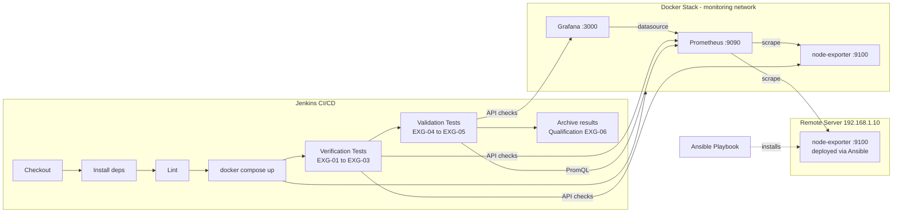

# DevOps Network Lab

A local DevOps laboratory simulating a full IVVQ cycle (Integration, Verification, Validation, Qualification) for a network monitoring infrastructure.

## Architecture



## Stack

| Tool | Role |
|---|---|
| **Ansible** | Installs and configures `node_exporter` on the target server |
| **Docker / docker compose** | Deploys the monitoring stack (Prometheus, Grafana, node-exporter) |
| **Prometheus** | Collects system metrics via periodic scraping |
| **Grafana** | Visualizes metrics through dashboards |
| **Robot Framework** | Automated IVVQ tests (verification + validation) |
| **Jenkins** | CI/CD orchestration: deploy → test → archive |

## IVVQ Approach

| Step | In this project |
|---|---|
| **Integration** | `docker compose up` assembles Prometheus, Grafana and node-exporter into a coherent system |
| **Verification** | `tests/verification.robot` — does each component work as specified? (EXG-01 to EXG-03) |
| **Validation** | `tests/validation.robot` — does the system meet the operational need? (EXG-04, EXG-05) |
| **Qualification** | Jenkins archives test results as a traceable, reproducible proof of conformance (EXG-06) |

Full traceability matrix: [`ivvq/requirements_traceability.md`](ivvq/requirements_traceability.md)

## Quick Start

```bash
cd ansible
ansible-playbook -i inventory.ini install_node_exporter.yml

cd ..
cp .env.example .env

docker compose up -d

pip install robotframework robotframework-requests
python3 -m robot tests/verification.robot tests/validation.robot

bash tests/verify_stack.sh
```

## Jenkins Pipeline

The `Jenkinsfile` automatically runs:
1. Checkout
2. Dependency installation (robotframework, robotframework-requests, docker-compose)
3. Stack deployment (`docker compose up -d`)
4. **Verification tests** — EXG-01 to EXG-03
5. **Validation tests** — EXG-04, EXG-05
6. Results archiving — EXG-06 (qualification proof)
7. Cleanup (`docker compose down`)

**Jenkins credential required**: create a secret text credential named `grafana-admin-password` in Jenkins before running the pipeline.

## Security

- Grafana admin password injected via environment variable (`.env`, not versioned)
- `node_exporter` runs under a dedicated system user with no login shell
- `.gitignore` excludes secrets, test reports and temporary files

## Local Testing

Run locally before pushing to Jenkins:

```bash
cp .env.example .env
echo "GRAFANA_ADMIN_PASSWORD=test123" >> .env
docker compose up -d
python3 -m robot tests/verification.robot tests/validation.robot
docker compose down
```

## Known Limitations

- No Alertmanager configured (planned for EXG-07)
- Static Ansible inventory
- No TLS between services
- Single environment configuration

## Troubleshooting

**Docker containers fail to start:**
```bash
docker-compose down -v
docker container prune -f
docker-compose up -d
```

**Tests timeout:**
- Increase the `sleep` duration in Jenkinsfile
- Verify Docker daemon is responsive
- Check system resources

**Prometheus not scraping metrics:**
- Verify `prometheus.yml` exists in the working directory
- Check container logs: `docker logs prometheus`
- Ensure `node-exporter` container is running: `docker ps`
